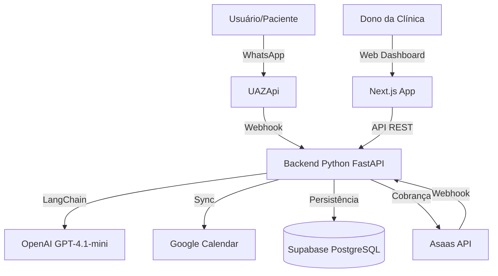

# 📘 Documentação Técnica - Agenda IA Sync

## 1. Visão Geral do Projeto
O **Agenda IA Sync** é uma plataforma SaaS B2B projetada para clínicas e consultórios médicos. O core do sistema é um agente de Inteligência Artificial que automatiza o agendamento de consultas via WhatsApp, gerenciando conflitos de agenda em tempo real, lembretes e o ciclo financeiro de assinaturas SaaS.

### 🏗️ Arquitetura de Alto Nível
O sistema opera em uma arquitetura de microsserviços modular, separando responsabilidades entre Frontend (Interface/Gestão), Backend (IA/Lógica de Negócio) e Serviços Externos (Calendários/Pagamentos/Mensageria).



### 🛠️ Stack Tecnológico

| Camada | Tecnologias Principais | Detalhes |
| :--- | :--- | :--- |
| **Frontend** | Next.js 14, React 18, TypeScript | App Router, Shadcn UI, Tailwind CSS, Lucide React. |
| **Backend** | Python 3.10+, FastAPI | Uvicorn, Pydantic, SQLAlchemy/Supabase-py. |
| **IA & Agentes** | LangChain, OpenAI API | `gpt-4o-mini`, Tool Calling (Function Calling). |
| **Banco de Dados** | Supabase (PostgreSQL) | Auth (GoTrue), Realtime, Storage. |
| **Infra/DevOps** | Docker, Docker Compose | Containers para Frontend, Backend, Redis, Celery/Worker. |
| **Filas & Cache** | Redis, Celery | Processamento assíncrono de tarefas pesadas. |

---

## 2. 🧠 Backend (`/backend`)

O backend é o cérebro da aplicação, expondo uma API REST via FastAPI.

### 2.1. Estrutura de Diretórios
```bash
backend/app/
├── api/                  # Routers (Endpoints)
│   ├── auth.py           # Autenticação de Usuários
│   ├── webhook.py        # Recebimento de mensagens (WhatsApp)
│   ├── webhook_asaas.py  # Webhooks de Pagamento (Asaas)
│   ├── subscriptions.py  # Lógica de Sync de Assinaturas
│   ├── calendars.py      # Gestão de Calendários
│   └── whatsapp.py       # Envio de mensagens ativas
├── core/                 # Configurações globais (DB, Vars)
├── services/             # Lógica de Negócio (Service Pattern)
│   ├── agente_service.py # 🤖 Cérebro da IA (LangChain Agent)
│   ├── payment_service.py# Integração Asaas
│   ├── google_calendar_service.py
│   └── buffer_service.py # Cache Redis para disponibilidade
└── main.py               # Entrypoint da aplicação
```

### 2.2. Módulos Críticos

#### 🤖 Agente de IA (`services/agente_service.py`)
Este serviço implementa um agente autônomo usando `LangChain` com `OpenAI Functions`.
- **Fluxo:** Recebe mensagem -> Identifica Intenção -> Escolhe Ferramenta -> Executa Ação -> Responde.
- **Ferramentas (Tools) Disponíveis para a IA:**
    1.  `verificar_disponibilidade(data, profissional)`: Consulta slots livres no Google Calendar (com cache Redis de 5min).
    2.  `realizar_agendamento(paciente, data_hora, profissional)`: Cria evento no Calendar e registro no Supabase.
    3.  `cancelar_agendamento(data, hora)`: Remove do Calendar e atualiza status no DB.
    4.  `listar_minhas_consultas()`: Busca histórico futuro do paciente.
- **Lógica de Slots:** O sistema calcula slots de N minutos (configurável, padrão 30min ou variável) subtraindo os eventos ocupados do Google Calendar do horário de funcionamento da clínica (ex: 08h-18h).

#### 💳 Gestão de Assinaturas (`api/subscriptions.py`)
Gerencia o ciclo de vida SaaS com lógica de "Mudança de Plano Segura".
- **Fluxo de Troca de Plano:** 
    1.  Frontend solicita troca -> Cria `checkout_session` (status: `esperando_troca`).
    2.  User paga -> Webhook recebe -> Chama `/sync`.
    3.  `/sync`: Verifica se o ciclo atual acabou.
        - Se **Sim**: Efetiva a troca (cancela anterior, ativa nova).
        - Se **Não**: Agenda a troca para o fim do ciclo (status: `waiting`).

---

## 3. � Frontend (`/frontend`)

Aplicação Next.js moderna focada na experiência administrativa e gestão da clínica.

### 3.1. Estrutura de Rotas (`app/`)

| Rota | Descrição | Proteção |
| :--- | :--- | :--- |
| `/` | Landing Page (Marketing) | Pública |
| `/login` | Tela de Login | Pública |
| `/cadastro` | Cadastro de nova clínica | Pública |
| `/dashboard` | **Área da Clínica** (Visão Geral) | **Privada** |
| `/dashboard/settings` | Configurações (Médicos, Horários, Plano) | **Privada** |
| `/pagamento-pendente` | Redirecionamento para inadimplentes | Pública |
| `/renovar-assinatura` | Tela de seleção de planos (Upgrade/Renovação) | **Privada** |
| `/termos-de-uso` | Documentos Legais | Pública |

### 3.2. Componentes Chave
- **`SubscriptionGuard`:** Wrapper que envolve o Dashboard. Verifica no Supabase se `clinicas.subscription_status` é `active`. Se não, bloqueia acesso e redireciona para pagamento.
- **`Sidebar` / `Header`:** Navegação contextual.
- **`SettingsPage`:** Permite adicionar médicos vinculados a Calendários do Google (`external_calendar_id`).

---

## 4. 🗄️ Modelo de Dados (Supabase)

O banco de dados relacional (PostgreSQL) é estruturado para suportar multi-tenancy (várias clínicas).

### Principais Tabelas

#### `clinicas` (Tenant)
| Coluna | Tipo | Notas |
| :--- | :--- | :--- |
| `id` | uuid | PK |
| `nome` | text | Nome da Clínica |
| `ia_ativa` | bool | Master switch do bot |
| `saldo_tokens` | int | Controle de consumo da IA |
| `subscription_status` | text | `active`, `past_due`, `canceled`, `trialing` |
| `hora_abertura` | int | Início expediente (ex: 8) |
| `hora_fechamento` | int | Fim expediente (ex: 18) |

#### `profissionais`
| Coluna | Tipo | Notas |
| :--- | :--- | :--- |
| `id` | uuid | PK |
| `clinic_id` | uuid | FK |
| `nome` | text | Nome do médico |
| `external_calendar_id` | text | ID do Calendário Google vinculado |

#### `consultas`
| Coluna | Tipo | Notas |
| :--- | :--- | :--- |
| `id` | uuid | PK |
| `paciente_id` | uuid | FK -> `leads` |
| `profissional_id` | uuid | FK |
| `horario_consulta` | timestamptz | Data/Hora ISO |
| `status` | text | `AGENDADA`, `CANCELADO`, `REALIZADA` |
| `external_event_id` | text | ID do evento no Google Calendar |

#### `leads` (Pacientes)
| Coluna | Tipo | Notas |
| :--- | :--- | :--- |
| `id` | uuid | PK |
| `telefone` | text | Identificador chave (WhatsApp) |
| `nome` | text | Nome capturado pela IA |

---

## 5. � Instalação e Execução

### Pré-requisitos
- Docker & Docker Compose
- Conta Supabase (URL e Key)
- Conta OpenAI (API Key)
- Credenciais Google Cloud (Service Account para Calendar)

### Passo a Passo Local

1.  **Configurar Variáveis de Ambiente:**
    Crie os arquivos `.env` na raiz do backend e frontend com base nos exemplos.
    ```bash
    # Backend .env
    DATABASE_URL=...
    OPENAI_API_KEY=...
    SUPABASE_URL=...
    SUPABASE_KEY=...
    ```

2.  **Subir Containers:**
    ```bash
    docker-compose -f docker-compose.prod.yml up --build
    ```
    Isso iniciará:
    - Backend (FastAPI): `http://localhost:8000`
    - Frontend (Next.js): `http://localhost:3000`
    - Worker (Celery): Processamento em background.
    - Redis: Cache e Broker.

3.  **Desenvolvimento:**
    Para rodar fora do Docker:
    ```bash
    # Backend
    cd backend
    pip install -r requirements.txt
    uvicorn app.main:app --reload

    # Frontend
    cd frontend
    npm install
    npm run dev
    ```

---

## 6. Integrações Externas

### Google Calendar
- A autenticação é feita via **Service Account** ou **OAuth2** (configurável em `google_calendar_service.py`).
- Cada `profissional` no banco tem um `external_calendar_id` que corresponde a uma agenda específica no Google.

### WhatsApp (UAZApi)
- O sistema espera receber webhooks no endpoint `/webhook/uazapi`.
- O payload deve conter o corpo da mensagem e o remetente (`remoteJid`).
- A resposta da IA é enviada de volta para a API de WhatsApp para entrega ao usuário.